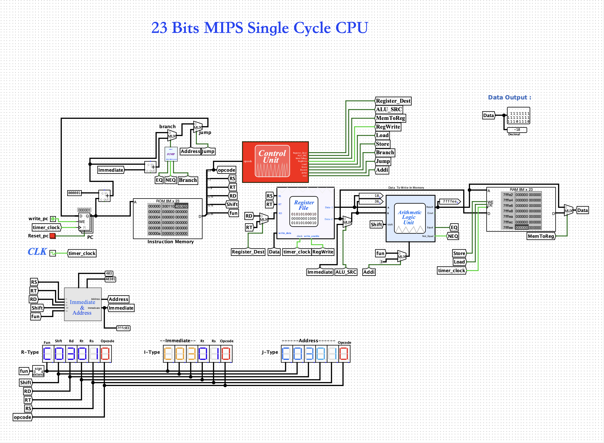

This project implements a custom 23-bit Instruction Set Architecture (ISA) using a single-cycle datapath design. The processor is designed to execute a set of arithmetic, logical, memory, and control flow instructions in one clock cycle.

The system is built with a focus on:

Efficient instruction encoding within a 23-bit constraint
Functional datapath design
Control unit signal generation
Simulation and verification using digital logic tools (e.g., Logisim)
🏗️ Architecture Design
🔢 Instruction Format

The 23-bit instruction is divided into multiple formats:

R-Type (Register)
| func (3) | shift (4) | rd (4) | rt (4) | rs (4) | opcode (4) |
I-Type (Immediate)
| immediate (11) | rt (4) | rs (4) | opcode (4) |
J-Type (Jump)
| address (19) | opcode (4) |
⚙️ Components
1. Register File
16 general-purpose registers (R0–R15)
Each register stores 23-bit data
2. ALU (Arithmetic Logic Unit)
